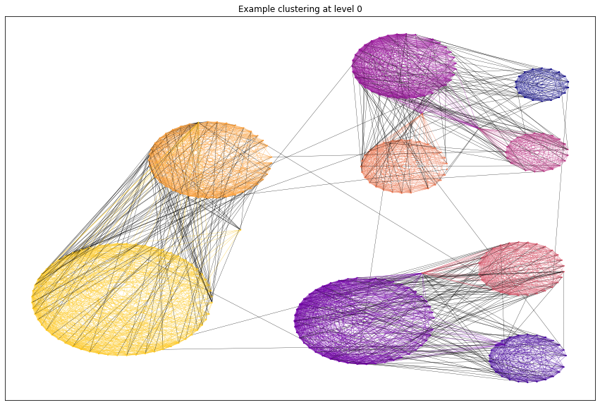
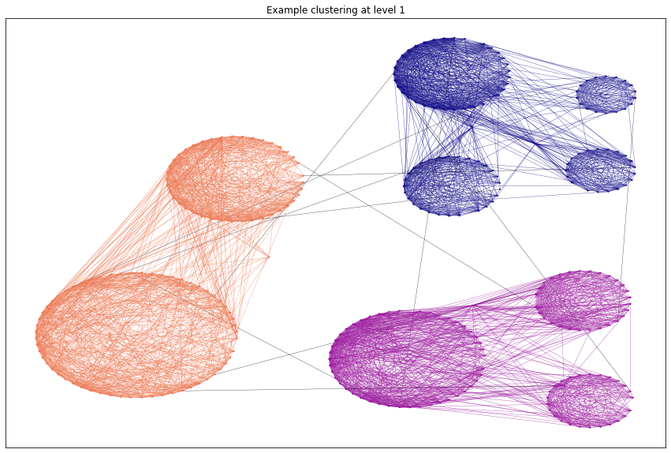

# PyOSLOM: Python Binding for OSLOM Graph Clustering

## Overview
PyOSLOM provides Python bindings for [OSLOM](http://www.oslom.org/) (Order Statistics Local Optimization Method), a powerful graph clustering algorithm. It supports:
- Both directed and undirected graphs
- Weighted and unweighted networks
- Multiple hierarchical levels of clustering

> ⚠️ Note: OSLOM is computationally intensive and best suited for medium-sized graphs.

## Features
- Seamless integration with NetworkX graphs
- Support for multiple operating systems (Linux, macOS, Windows*)
- Hierarchical community detection
- Deterministic results with seed control

## Requirements
- Python ≥ 3.10
- C++ 17 compiler
- Dependencies:
  - scikit-learn ≥ 0.24
  - pybind11 ≥ 2.6
  - networkx ≥ 2.5

## Installation

### Via pip (Recommended)
```bash
pip install pyoslom
```

### From source using Poetry
```bash
git clone https://github.com/bochen0909/pyoslom.git
cd pyoslom 
poetry install --no-root
poetry build
poetry install
```

### From source using setup.py
```bash
git clone https://github.com/bochen0909/pyoslom.git
cd pyoslom 
pip install -r requirements.txt
python setup.py install
```

## Quick Start
```python
import networkx as nx
from pyoslom import OSLOM

# Load or create your graph
G = nx.read_pajek("example.pajek")

# Initialize and run OSLOM
alg = OSLOM(random_state=123)
results = alg.fit_transform(G)

# Print clustering results
def print_clusters(clus):
    for k, v in clus.items():
        if k != 'clusters':
            print(f"{k}={v}")
    for level, clusters in clus['clusters'].items():
        print(f"Level: {level}, Number of clusters: {len(clusters)}")

print_clusters(results)
```

For detailed examples and visualizations, see [example.ipynb](example/example.ipynb).

## Visualization Examples



## Known Limitations
- Not thread-safe (use multiprocessing for parallel execution)
- Windows users need to build from source
- The underlying C++ codebase is complex and challenging to maintain

## License
- Original OSLOM C++ code: No explicit license (see [OSLOM website](http://www.oslom.org/))
- Python bindings: GPLv2

## Contributing
Contributions are welcome! Please feel free to submit issues and pull requests.
