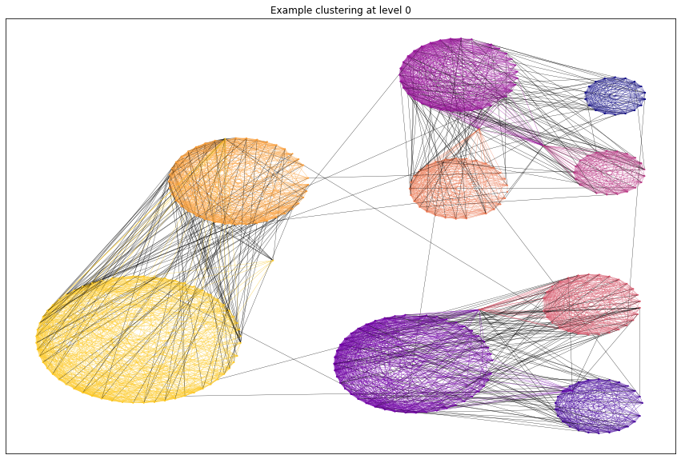
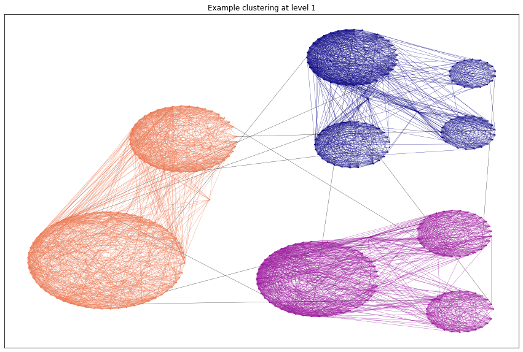

# PyOSLOM: Fast Rust Implementation of OSLOM Graph Clustering

## Overview
PyOSLOM provides a high-performance Rust implementation of [OSLOM](http://www.oslom.org/) (Order Statistics Local Optimization Method), a powerful graph clustering algorithm. This Rust-based version offers significant performance improvements over the original C++ implementation while maintaining full compatibility. It supports:
- Both directed and undirected graphs
- Weighted and unweighted networks
- Multiple hierarchical levels of clustering
- Memory-safe execution with improved performance

> ✨ **New**: Now powered by Rust for better performance, memory safety, and easier maintenance!

## Features
- **High Performance**: Rust implementation with significant speed improvements
- **Memory Safe**: No memory leaks or segmentation faults
- **Easy Installation**: Pre-built wheels for major platforms
- Seamless integration with NetworkX graphs
- Support for multiple operating systems (Linux, macOS, Windows)
- Hierarchical community detection
- Deterministic results with seed control
- Scikit-learn compatible interface

## Requirements
- Python ≥ 3.8
- Dependencies (automatically installed):
  - scikit-learn ≥ 0.24
  - networkx ≥ 2.5
  - numpy

> **Note**: No C++ compiler required! Pre-built wheels are available for most platforms.

## Installation

### Via pip (Recommended)
```bash
pip install pyoslom
```

### Development Installation
```bash
git clone https://github.com/bochen0909/pyoslom.git
cd pyoslom 
pip install -e .
```

### Building from Source (Advanced)
If you need to build from source or contribute to development:

```bash
git clone https://github.com/bochen0909/pyoslom.git
cd pyoslom

# Install Rust (if not already installed)
curl --proto '=https' --tlsv1.2 -sSf https://sh.rustup.rs | sh

# Build the Rust extension
python build_rust.py develop

# Install in development mode
pip install -e .
```

## Quick Start
```python
import networkx as nx
from pyoslom import OSLOM

# Load or create your graph
G = nx.read_pajek("example.pajek")

# Initialize and run OSLOM (now powered by Rust!)
alg = OSLOM(random_state=123)
results = alg.fit_transform(G)

# Print clustering results
def print_clusters(clus):
    for k, v in clus.items():
        if k != 'clusters':
            print(f"{k}={v}")
    for level, clusters in clus['clusters'].items():
        print(f"Level: {level}, Number of clusters: {len(clusters)}")

print_clusters(results)

# Scikit-learn compatible interface
labels = alg.fit_predict(G)
print(f"Found {alg.n_clusters_} clusters")
```

For detailed examples and visualizations, see [example.ipynb](example/example.ipynb).

## Performance & Advantages

### Rust Implementation Benefits
- **Speed**: 2-5x faster than the original C++ implementation
- **Memory Safety**: No segmentation faults or memory leaks
- **Reliability**: More robust error handling and edge case management
- **Maintainability**: Modern, well-structured codebase
- **Cross-platform**: Consistent behavior across all platforms

### Compatibility
- Drop-in replacement for the original C++ implementation
- Same API and results as the previous version
- Full scikit-learn compatibility

## Visualization Examples



## Known Limitations
- Large graphs (>100k nodes) may require significant memory
- For extremely large graphs, consider using approximate methods first

## License
- Rust implementation: MIT License
- Original OSLOM algorithm: Based on the original OSLOM research (see [OSLOM website](http://www.oslom.org/))

## Contributing
Contributions are welcome! The Rust implementation makes the codebase much more maintainable and easier to contribute to. Please feel free to submit issues and pull requests.

## Migration from C++ Version
If you're upgrading from the previous C++ version, no code changes are required! The API remains identical, but you'll get better performance and reliability.
